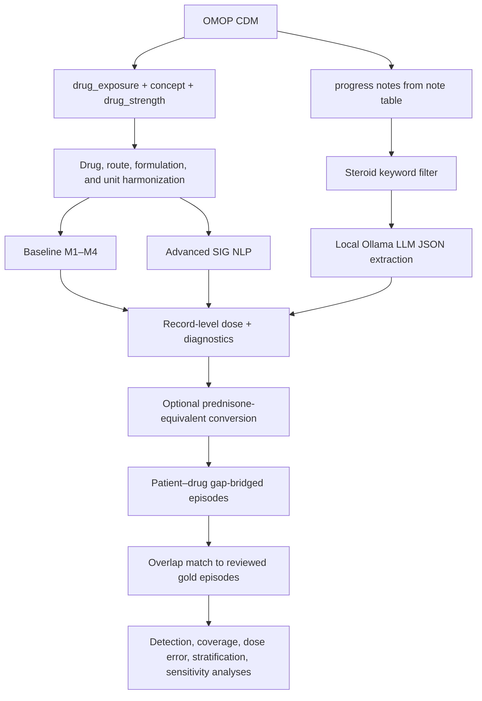
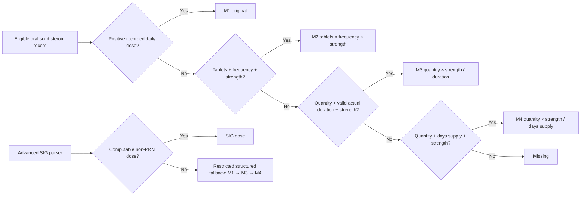

# Detailed Methods: SteroidDoseR and the AgentDose analysis workflow

## How to use this document

This chapter is a manuscript-ready description of the methodology implemented in the current SteroidDoseR repository. It covers both (1) the reusable R package and (2) the reference analysis scripts (`CodeToRun.R`, `LLMtoRun.R`, `CompareToRun.R`, and `RunAll.R`). Those layers overlap but are not identical. The package exposes structured-field, rule-based natural language processing (NLP), medspaCy, and hierarchical estimators; the reference study workflow compares three sources: structured OMOP `drug_exposure` data (Baseline), prescription SIG text (Advanced NLP), and OMOP progress notes processed by a local large language model (LLM).

This text describes implementation behavior rather than an idealized design. Values shown as defaults are the defaults in the code snapshot reviewed on 29 June 2026. Before submission, investigators should replace bracketed site-specific items, record the exact Git commit, R/package versions, database vocabulary version, local LLM model digest, hardware, and final cohort dates.

> **Important implementation qualification.** SteroidDoseR provides `convert_pred_equiv()` and three equivalency tables. However, the current reference scripts build the primary Baseline, NLP, and LLM episodes directly from native-drug milligrams; equivalency conversion is applied only in the NLP sensitivity analysis. Therefore, primary script outputs should be described as “mg/day in the source steroid” unless all records are prednisone/prednisolone or the scripts are amended to convert each record before episode construction. They should not be labelled prednisone-equivalent without that additional step.

## Methods

### Study design and objective

We developed SteroidDoseR, an R package and reproducible analysis workflow for estimating systemic corticosteroid exposure from observational electronic health record data represented in the Observational Medical Outcomes Partnership Common Data Model (OMOP CDM). The methodological objective was to transform heterogeneous medication evidence—structured dispensing fields, free-text prescription instructions, and narrative progress notes—into auditable daily-dose estimates and longitudinal treatment episodes. The workflow was designed for rheumatology cohorts, including myositis, while retaining configurable drug vocabularies, cohort filters, dose-equivalence tables, and database back ends.

The reference workflow evaluates three complementary estimators. The Baseline estimator uses structured OMOP fields and a deterministic cascade. The Advanced NLP estimator parses the `drug_exposure.sig` field using ordered regular expressions and structured-field fallbacks. The LLM estimator extracts steroid mentions and dose attributes from OMOP `note` text using a locally hosted Ollama model. Additional package methods—basic rule-based NLP, medspaCy note NLP, and a hierarchical Baseline–NLP cross-check—are available for secondary analyses but are not invoked by the current three-way reference workflow.

The unit of initial analysis is a medication or note record. Records are subsequently grouped into patient–drug treatment episodes. All estimators retain intermediate values and method/status labels to support record-level error analysis rather than returning only a final dose.

### Software architecture and reproducibility

SteroidDoseR is implemented in R (package metadata version 0.3.1; development documentation and NEWS identify the active development series as 0.4.0 or later). Core data manipulation uses `dplyr`, `stringr`, `tibble`, `lubridate`, `purrr`, `tidyr`, `readr`, `rlang`, and `jsonlite`. Live OMOP extraction can use OHDSI `DatabaseConnector` and `SqlRender`; the analysis scripts also support a pre-existing DBI connection. Clinical-note NLP can use Python through `reticulate` and medspaCy. The separate LLM workflow uses `httr2`, `future`, and `future.apply` to call a local Ollama server in parallel.

The reference entry point is `RunAll.R`. It defines shared study dates, the episode gap, cohort identifiers, gold-standard paths, LLM parameters, and a database connection, then sources the structured/NLP analysis, LLM analysis, and comparison scripts in sequence. Intermediate record- and episode-level CSV files, parameter manifests, checkpoints, plots, and comparison tables are written to timestamped directories. The intended study window in the reference configuration is 1 January 2015 through 31 December 2025, the default episode gap is 30 days, and a null patient filter includes all eligible database patients. These are configuration defaults, not universal methodological requirements.

For exact reproducibility, an analysis report should include the Git commit, R version, dependency lockfile or package versions, OMOP CDM and vocabulary versions, database dialect, steroid concept-set version, cohort definition, dates of extraction, local model name and immutable model digest, Ollama version, prompt text, decoding parameters, worker count, and operating system. Temperature is fixed at 0 in the current LLM request, but no explicit random seed or model digest is recorded; exact bitwise reproducibility is therefore not guaranteed across model or runtime updates.

### Data sources and connector abstraction

Public dose-estimation functions accept either a plain data frame or a `steroid_connector`. A data-frame connector wraps an in-memory table and detects capabilities from column presence. An OMOP connector stores database connection details and schema names, opens connections lazily, and closes temporary connections on function exit. Capability detection probes whether optional fields such as `sig`, `days_supply`, `quantity`, route, and source values are present. Connector-specific filters—drug concept identifiers, patient identifiers, and start/end dates—are ignored when a plain data frame is passed.

The minimum package data contract requires `person_id` and `drug_exposure_start_date`. Recommended fields include `drug_exposure_id`, `drug_concept_id`, `drug_source_concept_id`, `drug_exposure_end_date`, `quantity`, `days_supply`, `sig`, `route_concept_id`, `route_concept_name`, `dose_unit_source_value`, `drug_source_value`, `drug_concept_name`, `amount_value`, and `amount_unit_concept_id`. Required fields vary by estimator; absent optional fields cause the corresponding calculation path to be skipped.

### OMOP drug-exposure extraction

The packaged SQL template selects OMOP `drug_exposure` records whose start dates fall within the requested study interval. Optional concept and patient filters are inserted using SqlRender parameters. The query joins the vocabulary `concept` table to obtain standardized drug and route names. It also joins an aggregation of `drug_strength`, taking the maximum nonmissing `amount_value` and `amount_unit_concept_id` per `drug_concept_id`. This aggregation prevents multiple ingredient rows from duplicating a drug-exposure record; for single-ingredient corticosteroids, the maximum equals the available strength. Combination products require separate scrutiny because selecting the maximum ingredient strength is not a general combination-drug dose model.

The reference analysis restricts extraction with a bundled allow-list containing 3,839 steroid-related OMOP concept identifiers. It standardizes column names to lowercase, converts exposure dates to `Date`, and assigns a row-based exposure identifier when none is present. Before estimation, the study script reports field-level completeness for dates, quantity, days supply, strength, SIG, and route and counts nonempty SIG records.

The reference script additionally excludes drug concept names containing `solution`, `suspension`, `liquid`, `syrup`, `concentrate`, `drops`, or `/ml`. This study-level filter is stricter than the reusable Baseline function, which invalidates the strength for selected oral liquid patterns but does not necessarily remove every liquid row. The exclusion is necessary because the structured formulas assume that `quantity` counts solid units; when quantity represents volume and strength is a concentration, tablet-based arithmetic is invalid without administered volume.

### Cohort definition

The repository provides SQL templates for a base rheumatic-disease/DMARD cohort, a shingles-infection cohort, and a shingles-vaccination cohort. In the documented reference design, the base cohort requires a rheumatic disease diagnosis, at least one disease-modifying antirheumatic drug exposure, and age greater than 18 years. The shingles cohort combines herpes zoster evidence with antiviral exposure and is intersected with the base cohort. The vaccination cohort identifies zoster vaccination in drug or procedure data among the shingles population. Alternatively, investigators may supply any vector of `person_id` values or analyze the entire source database.

Because the cohort SQL and JSON configurations are site- and question-specific, publications must report the exact phenotype, concept sets, descendant expansion, observation-window rules, inclusion/exclusion logic, and attrition counts. The package’s dose estimators do not themselves establish causal eligibility or a new-user design.

### Drug-name normalization and steroid eligibility

Drug names are lowercased and whitespace-normalized, then mapped to canonical ingredients using ordered synonym patterns. Built-in mappings cover prednisone, prednisolone, methylprednisolone (including Medrol and Solu-Medrol), dexamethasone, hydrocortisone, triamcinolone, and budesonide. Site-specific mappings may override built-in output through a two-column regular-expression map (`pattern`, `canonical_name`).

Dose functions retain only canonical drugs that occur in the selected equivalency table with a nonmissing factor. Consequently, the default allow-list for imputation includes prednisone, prednisolone, methylprednisolone, dexamethasone, hydrocortisone, and triamcinolone; budesonide has a missing default factor and is excluded from these imputation functions unless a custom table supplies a factor. This is an eligibility side effect of the current implementation, not merely a conversion-status flag.

### Route classification and oral-systemic restriction

All four main package imputation families default to `filter_oral = TRUE`. Route is inferred using the first nonmissing value among `route_concept_name`, `route_source_value`, `drug_concept_name`, and `drug_source_value`. Ordered patterns classify inhaled, ophthalmic/otic, topical, injectable, oral, or other formulations. The inhaled and nonoral checks precede the oral check so names containing ambiguous formulation terms are not automatically retained. Oral indicators include explicit oral terms and solid-dose forms such as tablet or capsule; injection indicators include IV, IM, infusion, vial, and related strings.

Rows classified as oral are retained and rows classified otherwise are removed. When at least one route/name field exists but all candidate values for a row are missing, the current classifier replaces the missing combined string with an empty string and returns `other`, so that row is removed. If none of the four route/name fields exists anywhere in the input, the package warns and skips the oral filter entirely. Investigators should therefore report the proportion classified oral, nonoral, and other, plus whether filtering was skipped, and should not interpret the default as proof that every retained row was definitively oral.

### Strength extraction and unit safety

For structured calculations, tablet strength in milligrams is obtained first from `amount_value` when the unit is milligram (OMOP concept ID 8576). The Baseline implementation also accepts a missing unit or unmapped concept ID 0 as “unknown” and uses the numeric value, because some CDMs store 0 when the unit is not mapped. Values explicitly labelled microgram (9655), gram (8504), or another non-milligram unit are rejected. If no accepted numeric strength is available, the first `X mg` pattern in `drug_source_value` is used.

The basic and Advanced NLP strength fallback is slightly stricter when a unit column is present: any nonmissing unit other than 8576 is rejected, while a missing unit is accepted. Concept ID 0 is therefore accepted by Baseline but rejected by the NLP fallback. For name-based fallback, the parser uses the first available column in the order `drug_concept_name`, then `drug_source_value`; it does not try the source string when a concept-name column exists but lacks an mg pattern. The hierarchical method avoids the unit-policy difference by reusing Baseline’s unit-checked `strength_mg` for the SIG branch.

Liquid formulations matching oral solution, suspension, syrup, or mg/mL patterns have `strength_mg` set to missing in the Baseline method, with a warning. This prevents quantity-based formulas from treating volume as tablet count. When all strengths are missing, a diagnostic warning reports accepted `amount_value` counts and string matches.

### Structured-field Baseline estimator

The Baseline method computes four candidate daily doses for each drug-exposure record and selects the first nonmissing candidate in a user-specified order. The default order is M1, M2, M3, and M4:

| Step | Output label | Daily-dose equation | Required evidence |
|---|---|---|---|
| M1 | `original` | \(D_1 = D_{recorded}\) | Positive numeric `daily_dose` or pre-existing `daily_dose_mg` |
| M2 | `tablets_freq` | \(D_2 = T \times F \times S\) | Tablets per administration \(T\), administrations/day \(F\), strength \(S\) mg/tablet |
| M3 | `actual_duration` | \(D_3 = Q \times S / L\), where \(L=end-start+1\) | Quantity \(Q\), strength \(S\), valid exposure dates |
| M4 | `supply_based` | \(D_4 = Q \times S / DS\) | Quantity \(Q\), strength \(S\), positive `days_supply` \(DS\) |

M1 uses a recorded dose only when it is numeric and greater than zero. M2 can use pre-existing tablet and frequency columns. If they contain no usable values and a nonempty SIG is present, the default `m2_sig_parse = "auto"` invokes the basic SIG parser to populate them. M3 uses inclusive observed duration and is prioritized over the days-supply fallback in the default cascade. Nonpositive or reversed durations are set to missing. If the end-date column is absent, the Baseline function inserts the current date and warns; this behavior can yield a rough, time-dependent M3 estimate and should not be used without sensitivity analysis.

The function retains all candidate columns (`dose_from_original`, `dose_from_tablets_freq`, `dose_from_actual_duration`, and `dose_from_supply`), the selected `daily_dose_mg_imputed`, and `imputation_method`. Candidate values above the default 2,000 mg/day plausibility ceiling are not selected: the final dose is set to missing, the method is relabelled `missing`, and a warning is emitted. The ceiling may be changed or disabled but should be prespecified.

### Rule-based SIG NLP

#### Preprocessing

The parser lowercases and collapses whitespace. It translates English number words one through ten and selected Spanish number words and tablet/frequency terms into normalized forms. Purely alphabetic parenthetical clarifications are removed, while parentheticals containing digits, mg, or mcg are retained.

#### Frequency normalization

Frequency patterns are evaluated from specific to general to avoid premature matches. The parser converts all recognized schedules to administrations per day:

| Pattern class | Examples | `freq_per_day` |
|---|---|---:|
| Every N hours | `q6h`, `every 8 hours` | \(24/N\) |
| N times/day | `2 times a day`, `3x daily` | \(N\) |
| Latin abbreviations | QID, TID, BID | 4, 3, 2 |
| Daily | QD, daily, every morning, with breakfast | 1 |
| Alternate day | QOD, every other day | 0.5 |
| Every N days | `q3d`, every 3 days | \(1/N\) |
| N times/week | twice weekly | \(N/7\) |
| Every N weeks | every 2 weeks | \(1/(7N)\) |
| Weekly | weekly, qweek, q7d | \(1/7\) |
| Monthly | monthly, q30d | \(1/30\) |
| Residual once-daily phrases | nightly, once oral, by mouth without timing exclusions | 1 |

The ordered list contains 11 phases. Unrecognized frequency remains missing rather than being universally imputed as daily.

#### Dose components and flags

The basic parser extracts a numeric tablet/capsule count; when absent, it defaults to one tablet. It extracts durations expressed in days, weeks, or months and converts weeks to 7 days and months to 30 days. It identifies PRN language, free-text instructions such as “as directed,” and taper/decrement/alternate-day language.

Milligram expressions are resolved in this order: explicit parenthetical daily total, explicit parenthetical per-dose amount, plain parenthetical mg, explicit `mg/day` or equivalent, and bare mg. An explicit total is used directly. A per-dose amount is not multiplied by tablet count. Plain or bare mg is interpreted as strength and multiplied by tablet count. Daily dose is then

\[
D_{SIG}=\begin{cases}
D_{total}, & \text{explicit daily total};\\
D_{per\ administration}\times F, & \text{dose and frequency available};\\
D_{per\ administration}, & \text{recognized once-daily language};\\
NA, & \text{otherwise.}
\end{cases}
\]

Status precedence is `free_text`, `taper`, `prn`, `ok`, then `no_parse`; blank inputs are `empty`. Thus a string containing both taper and PRN language is labelled taper unless free-text language also matches. Every single-string parser is wrapped in `tryCatch`; malformed input returns a typed one-row result instead of terminating a batch.

#### Strength and structural fallbacks

When frequency and tablet count are available but the SIG contains no mg, the NLP pipeline uses `amount_value` if unit-compatible, followed by an mg pattern in `drug_concept_name` or `drug_source_value`. It computes strength × tablets × frequency and changes a successfully resolved record to `ok`.

By default, PRN records receive a missing daily dose and are excluded from structured fallbacks. For every other unresolved record—including empty, free-text, taper, or no-parse records—the method runs a restricted Baseline cascade containing M1, M3, and M4 but not M2. A successful fallback is labelled `fallback_<method>`; otherwise the original parsing status is retained. The same 2,000 mg/day ceiling is then applied.

### Advanced NLP and taper processing

The Advanced NLP parser extends the basic grammar with word-form and fractional tablet counts, weekly/monthly frequencies, generalized every-N-day schedules, and subdaily every-N-hour schedules. In the reference comparison it is called with `expand_tapers = FALSE`, `prn_action = "na"`, `filter_oral = TRUE`, and a 2,000 mg/day ceiling. Therefore, parseable steady doses are estimated, PRN doses are suppressed, and taper records are not expanded into separate intervals for the primary analysis.

When taper expansion is enabled, `parse_taper_schedule()` attempts two strategies. First, it identifies at least two explicit dose-duration blocks separated by “then,” commas, or semicolons (for example, 60 mg daily for 2 weeks, then 40 mg daily for 2 weeks). Second, it identifies a starting dose and fixed decrement interval (for example, decrease by 10 mg every week). Successful schedules produce ordered steps with daily dose, frequency, duration, and zero-based start/end day offsets. The vectorized expansion duplicates the source record once per step and adds taper-step metadata. Unparseable tapers remain single rows.

### Hierarchical Baseline–NLP estimator

The optional hierarchical estimator deliberately excludes Baseline M2 so the structured and text estimates remain partly independent. Its Baseline side uses M1, M3, and M4; its text side uses Advanced NLP and reuses the Baseline-derived strength when the SIG omits mg. Let \(D_B\) and \(D_N\) denote the two estimates. The default decision rule is:

| Evidence | Condition | Selected estimate | Label |
|---|---|---|---|
| Both | \(|D_B-D_N|\le1\) mg/day | NLP | `cross_checked` |
| Both | 1 < difference ≤ 5 mg/day | NLP by default | `nlp_preferred` |
| Both | difference > 5 mg/day | NLP | `nlp_override` |
| Baseline only | Baseline computable | Baseline | `baseline_only` |
| NLP only, steady | SIG computable | NLP | `nlp_fills_baseline` |
| NLP only, taper | Taper dose computable | NLP | `nlp_taper` |
| Neither | — | missing | `missing` |

Moderate disagreements can instead select Baseline or the arithmetic mean, producing `baseline_preferred` or `blended`. The blend is retained for backward compatibility and has no statistical weighting rationale. PRN records are set to missing and labelled `prn_excluded` by default. Thresholds can be tuned on a patient-level training split and evaluated on held-out patients; splitting by episode is avoided to prevent a patient’s records appearing in both folds.

### medspaCy clinical-note estimator

The optional package note estimator first runs Advanced NLP on the prescription SIG. Only unresolved statuses (`taper`, `free_text`, `no_parse`, or `empty`) with available note text are passed to a Python medspaCy pipeline. Extracted entities include dose, frequency, duration, taper context, negation, uncertainty, historical context, and note section. Current, non-negated, nonhistorical, certain entities are preferred; among candidates, the entity with the largest dose is selected. If frequency is absent but dose is present, this method assumes once daily.

Negated, uncertain, or exclusively historical mentions receive missing current dose and distinct statuses. Remaining failures proceed through strength fallback and restricted Baseline M1/M3/M4 fallback, followed by the 2,000 mg/day cap. Python errors are caught and converted to empty/error output rows. This method is distinct from the Ollama LLM workflow described below.

### Local LLM progress-note estimator

#### Note selection

The study-level LLM script queries the OMOP `note` table for nonempty progress notes with `note_type_concept_id = 32831`. It retains note identifier, patient identifier, date/datetime, type, class, title, and text and optionally restricts patients using the shared cohort vector. Before inference, a case-insensitive keyword filter retains notes mentioning a corticosteroid generic name, selected brand, or the generic terms corticosteroid, glucocorticoid, or steroid. This filter reduces inference volume but makes sensitivity conditional on the vocabulary; misspellings and unlisted synonyms are not sent to the model.

#### Model and prompt

The current default model is `qwen2.5:7b`, served locally through Ollama at `http://localhost:11434`. The request uses the chat endpoint, temperature 0, and a maximum of 256 generated tokens. Four parallel workers process notes in batches of 25. Requests time out after 60 seconds and may be retried up to three times with a fixed five-second interval for selected transient HTTP errors.

The prompt lists target generic and brand names and instructs the model to extract every target mention, returning only a JSON array. Each object must contain exactly `drug_name`, numeric-or-null `dose_value`, `dose_unit`, `frequency`, `route`, and a verbatim `dose_text`. Three demonstrations show a daily prednisone dose, a methylprednisolone taper, and a note with no steroid use. The inference endpoint is local, so note text is not intentionally transmitted to an external model provider; institutional deployment and logging controls remain the responsibility of the site.

#### Output validation and normalization

Markdown fences are removed if present, and output is parsed with `jsonlite`. Missing expected fields are added as missing values. Null/blank responses are labelled `no_output`; empty arrays are labelled `empty`; structurally unusable responses are `parse_error`; parseable objects are `ok`. The raw response is retained for audit. Processing time, note and patient identifiers, status, and extracted-drug count are logged. Completed batches overwrite a checkpoint CSV, allowing partial recovery.

For episode construction, only `ok` rows with numeric positive doses are retained. Frequency text is normalized to QID/four times daily = 4, TID/three times daily = 3, BID/twice daily = 2, weekly = 1/7, and monthly = 1/30; every other frequency, including missing or unrecognized text, defaults to 1. Dose units are converted using g = 1,000 mg, mcg = 0.001 mg, and mg = 1; other units are discarded. LLM daily dose is

\[
D_{LLM}=dose\_value\times unit\_factor\times frequency\_per\_day.
\]

Only oral or unspecified routes are retained; IV, IM, and topical strings are excluded when explicitly returned. Because the model’s `route = null` rows are retained and unknown frequency defaults to daily, these are sensitivity-favoring assumptions that require manual audit. The current script does not implement deterministic negation, uncertainty, historical-context, PRN, taper-step, or maximum-dose checks after generation; model compliance with the prompt is therefore part of the estimator and should be evaluated separately.

Each LLM extraction is a point observation with start and end both equal to `note_date`. Nearby observations are subsequently bridged into episodes. The method estimates documented dose at note times, not continuous medication possession between notes.

### Prednisone-equivalent conversion

The package can convert a native daily dose \(D\) to prednisone-equivalent dose \(D_{PE}=D\times k_d\), where \(k_d\) is a drug-specific anti-inflammatory potency factor. The default factors are:

| Drug | Default factor | Conservative | Aggressive |
|---|---:|---:|---:|
| Prednisone | 1.00 | 1.00 | 1.00 |
| Prednisolone | 1.00 | 1.00 | 1.00 |
| Methylprednisolone | 1.25 | 1.25 | 1.50 |
| Dexamethasone | 7.50 | 6.67 | 8.00 |
| Hydrocortisone | 0.25 | 0.20 | 0.25 |
| Triamcinolone | 1.25 | 1.00 | 1.25 |
| Budesonide | missing | missing | missing |

The default factors follow clinical glucocorticoid equivalence conventions described by Buttgereit et al. and Liu et al. [1,2]. Unknown drugs are labelled `unknown_drug`; known drugs with a missing factor are `missing_factor`. Conservative and aggressive tables support sensitivity analyses around potency uncertainty.

Conversion should occur at the record level before episode construction so that all episode doses share a common unit. The recommended package sequence is imputation → `convert_pred_equiv()` → `build_episodes(dose_col = "pred_equiv_mg")`. As noted above, the current primary reference scripts omit this conversion before primary episode construction. This must be corrected or transparently limited to a single-steroid analysis before reporting prednisone-equivalent results.

### Episode construction

Records are grouped by patient and canonical drug, sorted chronologically, and bridged using a permissible gap. When multiple records for the same patient, drug, and start date exist, only the row with the largest dose is retained. Missing or invalid end dates are replaced by the start date. Within each patient–drug series, the algorithm maintains the running maximum prior end date; a new episode begins when

\[
start_i-running\_max(end_{1:(i-1)})>gap\_days.
\]

Thus overlapping records and gaps of exactly 30 days are merged when `gap_days = 30`; a 31-day gap starts a new episode. Grouping by drug means switches between corticosteroid ingredients form separate episodes even when temporally continuous.

For each episode the package reports first start, last end, calendar duration, record count, median, minimum, maximum, and a record-duration-weighted mean dose:

\[
\bar D_w=\frac{\sum_i D_iL_i}{\sum_{i:D_i\ne NA}L_i},
\]

where \(L_i=end_i-start_i+1\). The current weighting sums record durations; overlapping records are not day-level de-duplicated, so overlap days can be represented more than once in the weighted mean. Optional categorical diagnostics such as `parsed_status` are propagated by statistical mode, with the first maximum used in ties.

Episodes with mean dose below 1 mg/day are flagged `dose_implausible`, and episodes above 100 mg/day are flagged `pulse_episode`. Flags do not automatically delete rows. The comparison script excludes low-dose flagged episodes from primary accuracy analysis and reports a sensitivity analysis excluding pulse episodes.

The gap parameter is evaluated at 0, 7, 14, 30, 60, and 90 days in the reference sensitivity analysis, reporting episode counts, duration quartiles, patients, and mean episodes per patient.

### Gold-standard preparation

The gold-standard parser accepts manually reviewed medication rows and parameterized column names. It replaces common null strings with missing values. Start date uses an ISO date when available, otherwise separate year/month/day fields; missing or invalid month/day components default to 15 June of the recorded year. End dates follow status-specific priority: past records use last-changed timestamp, then stop date, then missing; current/other records use last-changed timestamp, then the analysis date; when status is absent, a supplied generic end date can be used before the analysis date. Reversed intervals are swapped with a warning.

Dose strings are normalized and parsed for mg or g, per-kg dosing, and daily/weekly/monthly frequency. Grams are multiplied by 1,000. Weight-based, unitless, frequency-free, and unparseable entries receive explicit statuses. With the default `exclude_non_daily = TRUE`, weekly, monthly, infusion, weight-based, “every,” “over,” or gram-pattern regimens are excluded from daily-dose evaluation. Values outside the open interval (0, 300) mg/day are marked implausible and set to missing.

The gold parser’s output column is named `dose_daily_mg_equiv`, but the implementation performs unit and frequency normalization rather than drug-specific prednisone-equivalence conversion. If reviewed rows represent a generic “corticosteroids” category, investigators must establish that annotations were recorded as prednisone-equivalent doses or map each episode to its ingredient and convert it before comparison.

### Episode-level dose evaluation

Computed and gold episodes are matched within patient by any calendar overlap of at least one day. When multiple computed episodes overlap a gold episode, only the one with the greatest overlap is retained; ties resolve according to sorted input order. One comparison row is produced per gold episode among patients who appear in the computed data.

The evaluation separates patient detection from dose accuracy. Detection coverage is the proportion of all gold-positive patients also present in computed output. Dose accuracy denominators are then restricted to those common patients, so completely missed patients do not inflate dose error. Episode coverage is the proportion of common-patient gold episodes with a matched, nonmissing computed dose. The default computed dose is the duration-weighted episode mean; the legacy median can be selected.

For matched gold episode \(i\), let \(G_i\) be gold dose and \(C_i\) computed dose. The workflow calculates:

- absolute error: \(|C_i-G_i|\);
- bias error: \(C_i-G_i\);
- relative error: \(100(C_i-G_i)/G_i\);
- MAE: mean absolute error;
- MBE: mean bias error;
- RMSE: \(\sqrt{mean((C_i-G_i)^2)}\);
- median absolute error;
- MAPE: mean absolute percentage error;
- mean relative bias;
- Pearson and Spearman correlations when at least three matched rows are available.

Agreement is categorized as exact (≤5% absolute relative error), good (≤20%), moderate (≤50%), or poor (>50%). Errors are labelled overestimation, underestimation, or exact. Metrics are stratified by gold-dose ranges of (0,10], (10,20], (20,40], and >40 mg/day and, when propagated to episode level, by taper or parser status.

### Binary detection evaluation

When a separate confirmed steroid-negative cohort is available, `evaluate_detection()` forms episode-level true positives/false negatives for gold-positive periods and patient-level false positives/true negatives for gold-negative patients. A positive requires an overlapping computed episode at or above a prespecified dose threshold (0 mg/day in the reference script). Negative-patient observation windows can derive from their computed data, explicit enrollment dates, or a fixed study interval. Reported metrics include sensitivity, specificity, positive and negative predictive values, F1, accuracy, and Cohen’s kappa. The mixed episode-level positive and patient-level negative units should be stated explicitly.

### Sensitivity analyses and diagnostics

The reference comparison includes: (1) episode-gap sensitivity over 0–90 days; (2) conservative, default, and aggressive equivalence-table sensitivity for Advanced NLP; (3) exclusion of >100 mg/day pulse episodes; (4) stratification by NLP parse category; (5) frequency-normalization audits comparing `mg_per_admin × freq_per_day` with output dose and searching SIGs for potentially missed BID/TID/QID terms; and (6) dose-distribution, method-versus-gold scatter, and Bland–Altman analyses. Bland–Altman bias is the mean method-minus-gold difference and limits of agreement are bias ±1.96 standard deviations.

Hierarchical thresholds can be grid-searched using only training patients after a seeded 70/30 patient-level split, and final performance should be reported on the untouched validation patients. If many threshold combinations are compared, the selected grid and selection criterion should be archived.

### Missing data, safeguards, and auditability

The parsers are designed to return missing values and status labels for malformed clinical text instead of terminating a run. At package boundaries, structurally absent required columns can still raise informative errors. Date and numeric coercions convert unparseable values to missing, with date warnings. Dose ceilings warn and null the selected value rather than silently truncating it. Route ambiguity, missing strength, PRN use, taper language, fallback paths, note negation, and LLM parse failures are represented in diagnostic columns.

No imputation method can recover information that is absent from all available evidence. Quantity formulas assume solid oral units and adherence over the denominator interval; SIG parsing assumes the written instruction represents intended use; note NLP estimates documented rather than dispensed medication; and LLM extraction adds model-dependent uncertainty. Accordingly, coverage, error by status, unclassifiable routes, missing strengths, and manual review of extreme disagreements should be reported alongside aggregate accuracy.

### Ethics, privacy, and deployment

The package operates on patient-level medication and note data. Investigators must obtain applicable institutional approvals, restrict exports to approved locations, and avoid writing raw note text or model responses to unsecured directories. Although the LLM endpoint is local by default, `records_llm.csv`, checkpoints, and logs may contain protected health information, including verbatim `dose_text` and raw model responses. Access controls, retention limits, encryption, and disclosure review should be specified in the study protocol.

## Methodological Q&A

### Which method is the primary method?

The current reference workflow is comparative: Baseline, Advanced NLP, and local LLM estimates are evaluated separately. It does not select a universal winner in code. A manuscript should prespecify the primary estimator and treat the others as comparators or sensitivity analyses. The optional hierarchical estimator is suitable when the objective is an auditable fused estimate, but it is not part of the current three-script comparison.

### Is Baseline truly independent of NLP?

Not in its default package configuration. Baseline M2 automatically parses SIG text when tablet/frequency columns are unavailable. For an independent structured-versus-text comparison, use only M1/M3/M4, as the hierarchical method does. In the current `CodeToRun.R`, Baseline uses `m2_sig_parse = "auto"`; therefore its M2 records share text-derived information with Advanced NLP and the two methods are not fully independent.

### Why is actual duration tried before days supply?

The default cascade prioritizes the inclusive exposure interval over `days_supply`, then uses days supply as fallback. This is an implementation choice intended to favor an observed exposure window. It can be wrong when end dates are administratively generated or extended. Report candidate-method frequencies and compare alternate cascade orders if source end dates are unreliable.

### What happens when the end date is missing?

The standalone Baseline function substitutes the current date and warns. Episode construction instead treats a missing/invalid end as the start date. These different fallbacks can affect M3 dose and episode duration. A reproducible study should avoid time-varying “today” imputation, define a fixed censoring date, and report the missing-end-date sensitivity.

### Are missing routes treated as oral?

An explicitly unrecognized route becomes `other` and is removed. An `NA` route classification may be retained. If every route/name field is absent, filtering is skipped. Thus the oral filter is permissive for missing information and should be audited.

### Why is PRN set to missing rather than zero?

PRN text establishes availability but not realized daily consumption. Zero would assert no exposure; a scheduled dose would assert full use. Missing preserves uncertainty and prevents quantity-based fallbacks from assuming all supplied units were consumed. PRN prevalence should be reported separately.

### How are conflicting mg expressions handled?

The regex parser uses a fixed priority: explicit daily total, explicit per-dose parenthetical, plain parenthetical mg, explicit mg/day, then bare mg. It does not jointly reason over every number in complex text. Multi-drug or multi-step strings can therefore require taper expansion or manual review.

### Does taper expansion create calendar dates?

The taper parser creates day offsets and per-step rows. Downstream users must verify that exposure start/end fields are updated or otherwise interpret the offsets when building episodes. The reference workflow disables expansion, so primary NLP episodes summarize the unexpanded record or its structured fallback.

### Why can the duration-weighted mean still be biased?

It weights each record by its recorded duration, but overlapping records contribute overlapping days more than once. A true person-day exposure reconstruction would create one row per day and define a conflict rule for simultaneous prescriptions. The package mean is record-duration-weighted, not a de-overlapped daily area-under-the-curve estimator.

### Does `run_pipeline()` perform prednisone-equivalence conversion?

No in the current implementation. Despite documentation describing fetch → impute → convert → episodes, `run_pipeline()` currently imputes and then calls `build_episodes()` directly on native mg. Use the explicit three-step sequence with `convert_pred_equiv()` until the wrapper is corrected.

### Are the LLM outputs deterministic?

Temperature is zero, but exact reproducibility still depends on model weights, Ollama/runtime version, hardware kernels, and server behavior. Record the immutable model digest and retain raw responses. The script currently records the model tag, not its digest.

### How does the LLM handle unknown frequency?

It defaults to once daily. This improves yield but can overestimate weekly/intermittent use or misinterpret an isolated dose. A stricter analysis should set unknown frequency to missing and compare coverage and error.

### How does the LLM handle negation and historical mentions?

The prompt demonstration asks for an empty array for “No steroid use,” but the postprocessor does not independently validate negation or temporality. Performance therefore depends on model compliance. The medspaCy package method has explicit negation, uncertainty, and historical-context handling; the Ollama workflow does not.

### Are LLM taper doses decomposed?

No. The demonstration returns one object for a multi-step taper and the downstream normalizer converts only the returned `dose_value` and `frequency`. It does not reconstruct subsequent steps or durations. Tapers require a dedicated schema and step-level postprocessing if cumulative exposure is an outcome.

### Why are progress-note observations bridged for 30 days?

The note date is a point observation, and gap bridging assumes nearby documentation refers to a continuing treatment period. This is not medication-possession evidence. Gap sensitivity is therefore particularly important for LLM episodes, and the gap may need to differ from pharmacy-record episodes.

### Is the gold standard already prednisone-equivalent?

Not necessarily. The parser’s `dose_daily_mg_equiv` name is potentially misleading: it normalizes g to mg and frequency to daily but does not multiply by a steroid-specific factor. Review documentation must state whether annotators entered prednisone-equivalent doses. Otherwise, map each reviewed episode to an ingredient and convert it.

### Why are dose errors restricted to common patients?

Patients completely missed by an estimator represent detection failures, not observations with a numeric dose error. The package reports patient detection coverage separately and calculates MAE/MBE among common patients. Both numbers are needed; reporting MAE alone can make a low-coverage method appear accurate.

### How are multiple computed episodes matched to one gold episode?

The computed episode with the greatest calendar overlap is selected. Dose similarity is not used for matching, which avoids choosing a match because its answer is closer to gold. One computed episode may still be selected for more than one gold period if it overlaps them.

### What should be manually reviewed?

At minimum: doses above the clinical range, doses below 1 mg/day, pulse episodes, unknown routes retained by permissive filtering, all LLM outputs with null route or defaulted frequency, taper/PRN/free-text records, Baseline–NLP disagreements, unit concept 0, combination drugs, and gold records with imputed dates.

### What belongs in a publication’s reproducibility appendix?

Include exact cohort SQL/JSON, steroid concept IDs and vocabulary date, field-completeness funnel, excluded formulations/routes, cascade-method counts, parser-status counts, prompt and demonstrations, model digest, inference failures/retries, conversion table, episode gap, low/high-dose flags, gold parsing rules, overlap rule, metric formulas, train/validation patient IDs or seed, sensitivity grids, and a code commit.

## Figure 1. End-to-end analysis flow

## Figure 2. Baseline cascade and Advanced NLP fallback

## Reporting checklist

| Domain | Minimum item to report |
|---|---|
| Software | Git commit, package/dependency versions, execution date |
| Data | OMOP version, vocabulary date, study dates, source tables |
| Cohort | Phenotype, concept sets, inclusion/exclusion, attrition |
| Drug selection | Concept allow-list version and formulation exclusions |
| Route | Classification fields, missing/unknown handling, retained counts |
| Strength | Unit policy, concept 0 policy, string fallback, liquid handling |
| Baseline | Candidate order and count selected by each M1–M4 step |
| NLP | Parser version, PRN policy, taper expansion setting, status counts |
| LLM | Note type, keyword list, prompt, model digest, temperature, timeout/retries, failures |
| Conversion | Whether primary results are native mg or prednisone-equivalent; factor table |
| Episodes | Gap, same-day deduplication, mean/median choice, overlap handling |
| Gold standard | Reviewer protocol, dose units, date imputation, excluded statuses |
| Evaluation | Patient detection coverage, episode coverage, matching rule, all error metrics |
| Sensitivity | Gap, equivalence factors, pulses, unknown LLM frequency, parser strata |
| Privacy | Local/external model path, raw-text logging, storage and access controls |

## References

1. Buttgereit F, da Silva JAP, Boers M, et al. Standardised nomenclature for glucocorticoid dosages and glucocorticoid treatment regimens: current questions and tentative answers in rheumatology. *Annals of the Rheumatic Diseases*. 2002;61(8):718–722. doi:10.1136/ard.61.8.718.
2. Liu D, Ahmet A, Ward L, et al. A practical guide to the monitoring and management of the complications of systemic corticosteroid therapy. *Allergy, Asthma & Clinical Immunology*. 2013;9:30. doi:10.1186/1710-1492-9-30.
3. Xiong C, Martin B, Westlund E, Kelly W, Mecoli C. AgentDose: Toward Accurate and Scalable Steroid Dose Extraction in OMOP Using NLP Parsers and LLM Agents. OHDSI Global Collaborator Showcase; 2025. Abstract 205.

## Source log

| Key | Status | Verified source | Methodological use |
|---|---|---|---|
| `buttgereit2002` | Peer-reviewed journal article | DOI and bibliographic record verified via PubMed/PMC | Glucocorticoid nomenclature and default equivalence rationale |
| `liu2013` | Peer-reviewed open-access review | DOI and bibliographic record verified via PMC | Systemic corticosteroid dose equivalence context |
| `xiong2025agentdose` | Conference showcase brief report | Title, authors, year, and abstract number verified on OHDSI | Provenance of AgentDose/SteroidDoseR workflow |

All package-behavior statements in this chapter were verified directly against the repository source and tests rather than inferred from the literature.
